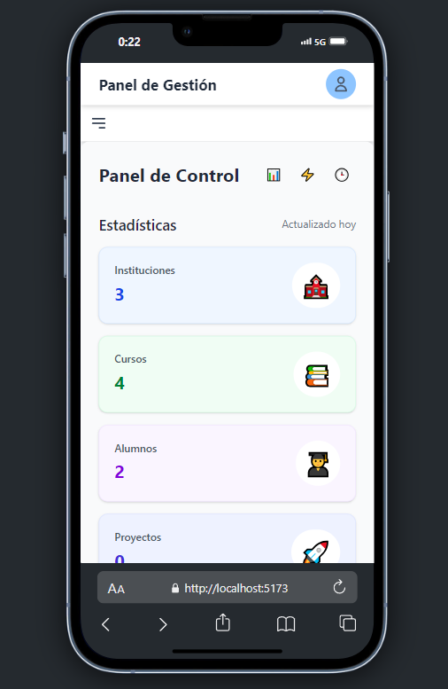
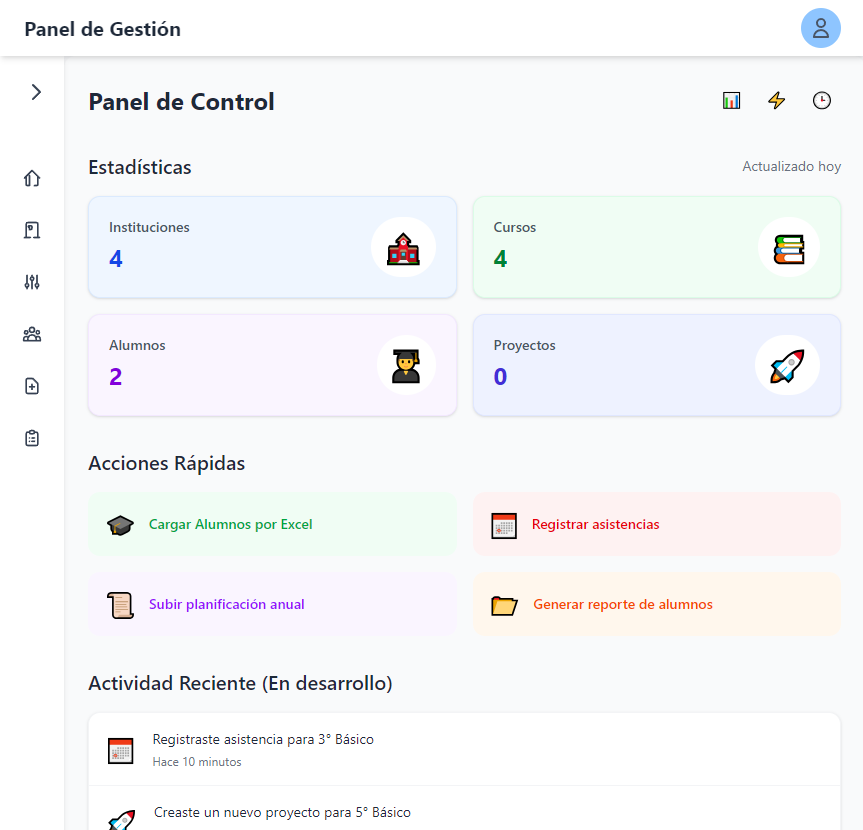
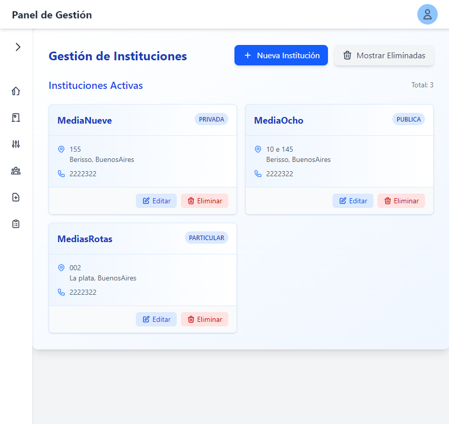
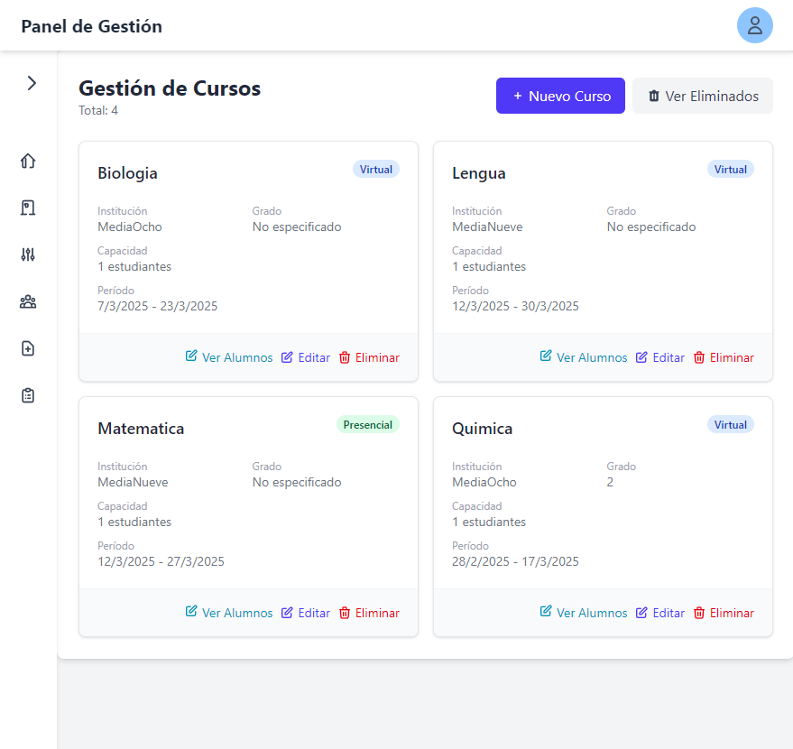
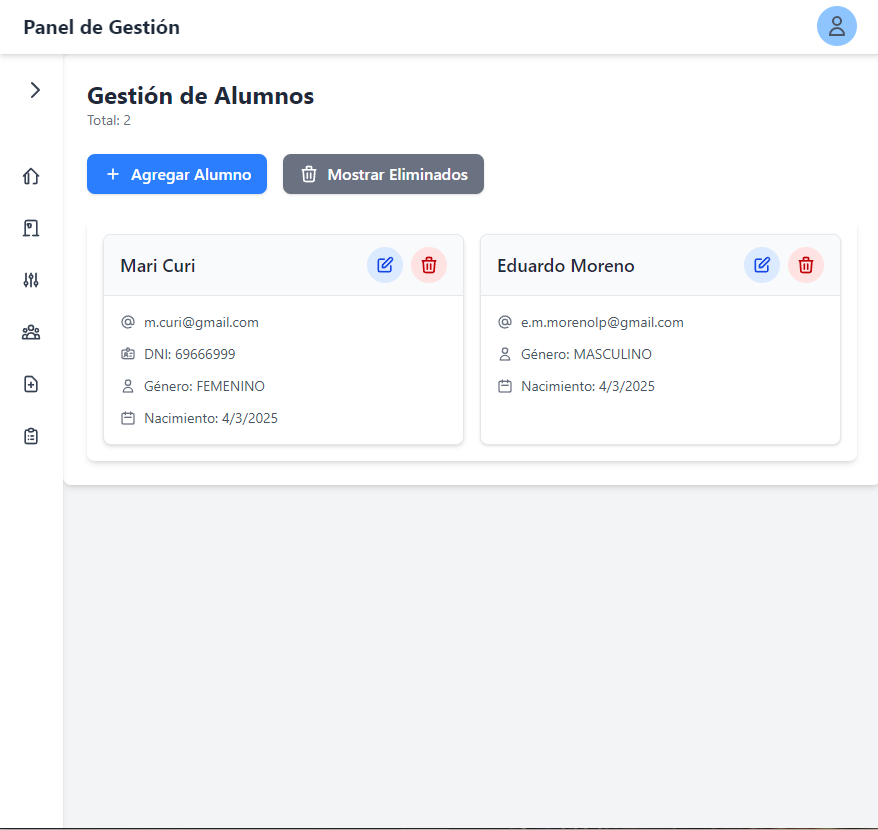

## 🎓 **Servicio Docente** – Plataforma SaaS para Gestión Educativa

🔹 **Gestión completa de instituciones, cursos y alumnos.**  
🔹 **Registro de asistencias y planificación académica.**  
🔹 **Plataforma intuitiva para docentes.**

---

## 🌟 **¿Qué es Servicio Docente?**

**Servicio Docente** es una plataforma SaaS diseñada para **profesores**, permitiendo a docentes gestionar **cursos, alumnos, asistencias, planificaciones y proyectos** de manera eficiente.

Nuestra meta es **optimizar la organización académica** mediante una interfaz moderna y herramientas automatizadas.

> **📌 Beneficio principal:** Menos tiempo en administración, más tiempo para la enseñanza.

---

## 🚀 **Características Clave**

✅ **Gestión de Instituciones** – Organiza múltiples escuelas.  
✅ **Control de Cursos y Horarios** – Asigna clases y visualiza disponibilidad.  
✅ **Seguimiento de Alumnos** – Monitorea asistencias, rendimiento y participación.  
✅ **Planificación Académica** – Diseña un plan anual de contenidos.  
✅ **Gestión de Proyectos** – Organiza actividades y reportes educativos.  
✅ **Importación de Datos** – Carga alumnos y calificaciones desde Excel.  
✅ **Dashboard Interactivo** – Resumen de métricas y notificaciones.

---

## 🖥️ **Tecnologías Utilizadas**

| **Tecnología**                           | **Uso**                       |
| ---------------------------------------- | ----------------------------- |
| **Frontend:** React + Vite + TailwindCSS | UI moderna y rápida ⚡        |
| **Backend:** Node.js + Express           | API escalable y segura 🔐     |
| **Base de Datos:** MySQL + Prisma        | Gestión eficiente de datos 🗄️ |
| **Autenticación:** JWT + OAuth (Google)  | Accesos seguros 🔑            |

---

## 📸 **Capturas de Pantalla**

📌 _Una imagen vale más que mil palabras. Aquí tienes una vista previa de Servicio Docente:_

📊 _Dashboard central con métricas clave._  
  

🏫 _Lista de instituciones._  

📚 _Lista de cursos._  

👨‍🎓 _Lista de alumnos con seguimiento de rendimiento._  

---

## 📈 **Roadmap del Proyecto**

📍 **Fase 1:** Desarrollo del MVP ✅  
📍 **Fase 2:** Optimización de UX/UI 🎨  
📍 **Fase 3:** Implementación de reportes 📊  
📍 **Fase 4:** Despliegue en la nube ☁️

---

## 💡 **¿Por qué elegir Servicio Docente?**

🎯 **Optimización del tiempo docente** – Menos burocracia, más enseñanza.  
🔍 **Datos centralizados y accesibles** – Todo en una sola plataforma.  
📊 **Análisis y reportes educativos** – Mejora la toma de decisiones.  
🌎 **Acceso desde cualquier dispositivo** – 100% basado en la nube.

---

## 📩 **Contacto y Redes**

- 📧 Email: ***serviciodocente.saas@gmail.com***
- 🔗 LinkedIn: 
- 🌐 Web:

👨‍💻 Desarrollado con ❤️ por **Eduardo M Moreno**
- 🌐[LinkedIn]: https://lnkd.in/dSjP_G76
- 💻[Portafolio]: https://lnkd.in/eV2e-P96
- 👨‍💻[GitHub]: https://lnkd.in/ddAf7TN8
- 📧[Correo electrónico]: e.m.morenolp@gmail.com